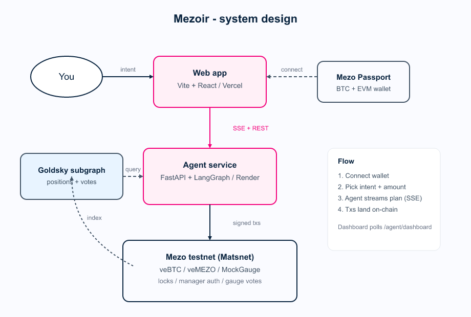
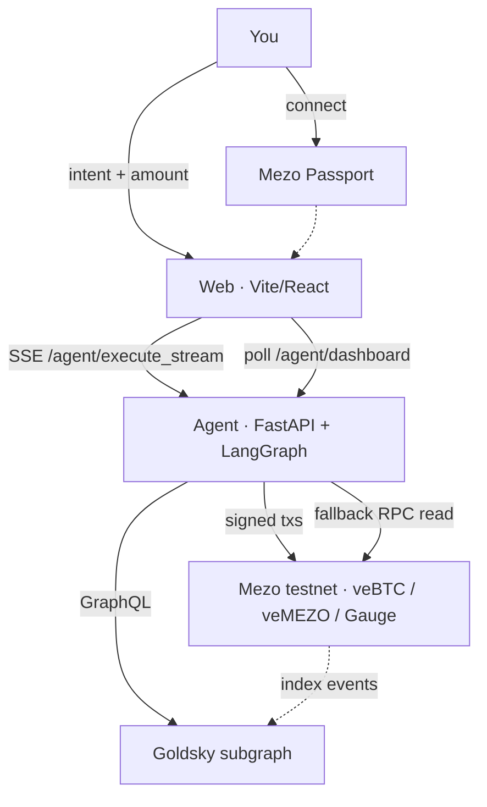

# Mezoir

**Intent-based agent for Mezo's ve-economy.**  
You state a goal → the agent reads chain state → picks actions → executes on testnet → explains why.

Mezo Hackathon 2026 · MEZO Track

| | |
|---|---|
| **Live app** | [mezoir.vercel.app](https://mezoir.vercel.app) |
| **Agent API** | [mezoir-1.onrender.com](https://mezoir-1.onrender.com) |
| **Explorer** | [explorer.test.mezo.org](https://explorer.test.mezo.org) |
| **Network** | Mezo testnet (Matsnet) |
| **Demo video** | [Coming soon] |

---

## Contents

- [What it does](#what-it-does)
- [System design](#system-design)
- [Repo map](#repo-map)
- [Quick start](#quick-start)
- [API surface](#api-surface)
- [Stack](#stack)
- [Roadmap](#roadmap)

---

## What it does

| Step | You | Mezoir |
|------|-----|--------|
| 1 | Connect wallet (Mezo Passport) | — |
| 2 | Pick intent + amount | Parses goal into profile + priority |
| 3 | Click **Run agent** | Streams decisions, rationale, actions (SSE) |
| 4 | — | Locks veBTC/veMEZO, authorizes manager, votes gauges |
| 5 | Read explanation | Plain-English audit trail + tx links |

**Preset intents**

| Intent | Profile |
|--------|---------|
| Maximize my BTC yield | `btc_heavy` |
| I'm MEZO-heavy, optimize voting returns | `mezo_heavy` |
| Balanced: optimize across both | `balanced` |
| Park me defensively | `defensive` |
| Conservative — defensive lock, max flexibility | `defensive_lock` |
| Yield Farmer — max lock, max emissions | `yield_farmer` |
| Diversifier — spread across both assets | `just_diversify` |

**Why it exists** — Mezo's ve stack (veBTC, veMEZO, gauges, epochs) is powerful but heavy. Mezoir collapses that into one sentence: *what do you want?*

---

## System design

### Diagram (Excalidraw)

Open in [excalidraw.com](https://excalidraw.com) → **Open** → load:

```
docs/system-design.excalidraw
```

**Preview** (PNG — GitHub does not reliably embed SVG images in README):



[Open editable SVG](docs/system-design.svg) · [Open Excalidraw source](docs/system-design.excalidraw)

> **Tip:** Edit the `.excalidraw` file freely — it's the source of truth for architecture docs.

### One-page flow (Mermaid)



| Component | Role |
|-----------|------|
| **Web** | UI, wallet connect, live dashboard, SSE consumer |
| **Agent** | Intent parse, strategy, LLM rationale, tx execution |
| **Goldsky** | Fast dashboard aggregates (RPC fallback if unset) |
| **Contracts** | Canonical veBTC (`0x38E3…130a`), canonical veMEZO (`0xaCE8…111b`), MockGauge (`0x6E60…bc40`) on Matsnet |

---

## Repo map

```
mezoir/
├── web/                 # Vite + React frontend (Vercel)
├── agent/               # FastAPI agent service (Render)
├── contracts/           # Foundry — MockGauge (active); MockVeBTC/MockVeMEZO retained for local dev parity
├── mezoir-subgraph/     # Goldsky subgraph (positions + votes)
└── docs/
    ├── system-design.excalidraw
    ├── system-design.svg
    └── system-design.png
```

| Path | Run with |
|------|----------|
| `web/` | `npm run dev` → `http://localhost:5173` |
| `agent/` | `uvicorn app.main:app --port 8001` |
| `contracts/` | `./tools/foundry/forge.exe build` |
| `mezoir-subgraph/` | Goldsky CLI deploy |

---

## Quick start

### 1 · Agent

```bash
cd agent
cp .env.example .env   # set RPC, contract addresses, operator key
python -m venv .venv
.venv/Scripts/pip install -r requirements.txt   # Windows
uvicorn app.main:app --host 127.0.0.1 --port 8001
```

```bash
curl http://127.0.0.1:8001/health
curl http://127.0.0.1:8001/agent/dashboard
```

**Key env vars** (`agent/.env.example`)

| Variable | Purpose |
|----------|---------|
| `MEZO_TESTNET_RPC_URL` | Mezo RPC |
| `VEBTC_PROXY_ADDRESS` / `VEMEZO_PROXY_ADDRESS` | Contract targets |
| `AGENT_OPERATOR_PRIVATE_KEY` | Signs agent txs |
| `GOLDSKY_SUBGRAPH_URL` | Optional — dashboard via subgraph |
| `ANTHROPIC_API_KEY` | LLM intent + explanations |

### 2 · Web

```bash
cd web
cp .env.example .env
npm install
npm run dev
```

**Key env vars** (`web/.env.example`)

| Variable | Purpose |
|----------|---------|
| `VITE_AGENT_URL` | Agent base URL (e.g. `http://localhost:8001`) |
| `VITE_WALLETCONNECT_PROJECT_ID` | [Reown Cloud](https://cloud.reown.com) |
| `VITE_VEBTC_PROXY_ADDRESS` | Optional — not displayed in current UI |

Open **http://localhost:5173** → Connect wallet → Run agent.

### 3 · Contracts (optional local deploy)

```bash
cd contracts
cp .env.example .env
./tools/foundry/forge.exe build
./tools/foundry/forge.exe script script/DeployMockVeBTC.s.sol --rpc-url $MATSNET_RPC_URL --broadcast
```

---

## API surface

| Method | Path | Purpose |
|--------|------|---------|
| `GET` | `/health` | Liveness |
| `GET` | `/agent/dashboard` | Live positions (Goldsky → RPC fallback) |
| `GET` | `/agent/execute_stream` | **SSE** — full intent run |
| `GET` | `/agent/lock/{id}` | veBTC lock read |
| `GET` | `/agent/lock_mezo/{id}` | veMEZO lock read |
| `POST` | `/agent/lock_btc` | Lock BTC |
| `POST` | `/agent/lock_mezo` | Lock MEZO |
| `POST` | `/agent/set_allowed_manager` | Manager auth |

**SSE event types:** `log` · `parsed_intent` · `chain_snapshot` · `decision_options` · `decision_made` · `action_start` · `action_result` · `vote_cast` · `explanation` · `done`

---

## Stack

| Layer | Tech |
|-------|------|
| Frontend | Vite, React 18, Tailwind, Mezo Passport, RainbowKit |
| Agent | Python 3.11, FastAPI, web3.py v7, Anthropic Claude SDK |
| Indexing | Goldsky subgraph (`mezoir-subgraph/`) |
| Chain | Mezo testnet — canonical veBTC + veMEZO, MockGauge (real Mezo gauge integration scaffolded for v0.2) |
| Deploy | Vercel (web) · Render (agent) |

---

## Roadmap

| Version | Scope |
|---------|--------|
| **v0.1** *(now)* | Single operator, preset intents, SSE UX, testnet txs |
| **v0.2** | Cross-chain onboarding, user-owned operator keys |
| **v0.3** | Strategy marketplace — plug-in intents |
| **v1.0** | Default execution layer across Mezo ve venues |

---

## Status & credits

Built April–May 2026 on **Mezo Matsnet**. Testnet demo — not financial advice.

Built on Mezo primitives: Matchbox, veBTC, veMEZO, gauges. Thanks to the Mezo team and community for hackathon support.

---

## Hackathon eligibility

**Main track entry:** MEZO Utilization Track. Mezoir builds utility for MEZO tokens via veMEZO locking + gauge voting + agent-driven governance — directly addressing the track's "AI agent payments in MEZO" and "Governance & DAO tools" focus areas.

**Sponsor-track integrations claimed:**

| Sponsor | What Mezoir uses | Where to verify |
|---------|------------------|-----------------|
| **Validation Cloud** | Dedicated Mezo RPC endpoint replacing public-rate-limited RPC for all agent reads + tx broadcasts | `agent/.env`: `MEZO_TESTNET_RPC_URL`; agent service running at [mezoir-1.onrender.com](https://mezoir-1.onrender.com) |
| **Goldsky** | Live subgraph indexing Deposit + Voted events on canonical veBTC, veMEZO, and MockGauge. Powers the dashboard's recent activity feed and live positions (sub-second response vs RPC's ~10 eth_calls per refresh). | Subgraph deployed at `mezoir/0.0.2`; query path in `agent/app/services/goldsky.py`; mapping logic in `mezoir-subgraph/` |

**Scaffolded for future:** Tenderly transaction simulation — Mezo testnet not currently on Tenderly's supported chains list; integration architecture is in place and ready when chain support arrives.

---

## Why this fits the Mezo Foundation's 2026 direction

The Supernormal Foundation's 2026 roadmap explicitly names "agent economy infrastructure" and veNFT primitives as priorities for BitcoinFi. Mezoir is exactly that: an agent that operates against the ve-economy's primitives (veBTC, veMEZO, gauges) with deliberation visible to the user — the foundational shape of how autonomous BitcoinFi agents will work.
